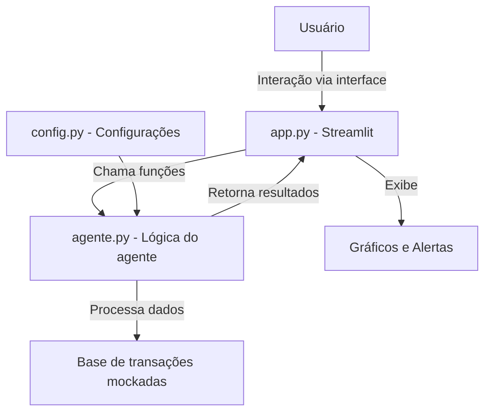

# desafio_
"O desafio propõe a criação de uma experiência digital voltada ao relacionamento financeiro, guiada por IA generativa e fundamentada em boas práticas de experiência do usuário."
# Documentação do Agente

## Caso de Uso

### Problema
> Qual problema financeiro seu agente resolve?

[Muitos usuários têm dificuldade em organizar suas finanças pessoais de forma prática e acessível.
O agente proposto resolve o problema de controle básico de receitas e despesas, ajudando a calcular saldo disponível e oferecer respostas rápidas sobre a situação financeira atual.
Dessa forma, o usuário consegue visualizar seus gastos, entender para onde vai o dinheiro e tomar decisões mais conscientes.]

### Solução
> Como o agente resolve esse problema de forma proativa?

[O agente vai resolver o problema de forma proativa ao organizar receitas e despesas e vai apresentar os resultados em gráficos claros e objetivos. Ele vai alertar o usuário quando houver despesas acima de um limite definido, ajudando a manter o controle financeiro.]

### Público-Alvo
> Quem vai usar esse agente?

[O agente vai ser usado por pessoas que desejam organizar suas finanças pessoais de forma simples e objetiva.
Ele será útil para usuários que querem acompanhar receitas e despesas]

---

## Persona e Tom de Voz

### Nome do Agente
[FinControl]

### Personalidade
> Como o agente se comporta? (ex: consultivo, direto, educativo)

[O agente vai se comportar de forma direta e objetiva, apresentando receitas e despesas em gráficos claros e alertando o usuário sobre gastos elevados.]

### Tom de Comunicação
> Formal, informal, técnico, acessível?

[O agente vai adotar um tom acessível e direto, utilizando uma linguagem clara e objetiva.
Ele não vai usar termos técnicos complexos nem uma postura excessivamente formal]

### Exemplos de Linguagem

- Saldo atual: "Seu saldo atual é de R$ 1.000"
- Gráfico de despesas: "Aqui está a distribuição das suas despesas deste mês."
- Alerta de gasto elevado: "⚠️ Atenção: você registrou uma despesa de R$ 1.500 em 'Cartão de Crédito', que ultrapassa o limite definido."
- Resumo de receitas e despesas: "Você teve R$ 2.000 de receitas e R$ 1.200 de despesas neste período."
---

## Arquitetura

### Diagrama

### Componentes

### Componentes  

| Componente           | Descrição                                                                 |
|----------------------|---------------------------------------------------------------------------|
| Interface            | [ex: Aplicação em Streamlit para exibir gráficos e alertas]               |
| Lógica do Agente     | [ex: Módulo em Python que organiza receitas e despesas e verifica limites]|
| Base de Conhecimento | [ex: JSON/CSV com transações mockadas]                                    |
| Validação            | [ex: Alertas de despesas acima do limite definido]                        |

---

## Segurança e Anti-Alucinação

### Estratégias Adotadas

- [x] Agente só responde com base nos dados fornecidos (transações mockadas)
- [x] Respostas são claras e objetivas, sem jargões técnicos
- [x] Quando não há dados disponíveis, admite e informa ao usuário
- [x] Não faz recomendações de investimento ou consultoria financeira
- [x] Exibe gráficos simples para facilitar a visualização das finanças
- [x] Emite alertas quando despesas ultrapassam limites definidos

### Limitações Declaradas
> O que o agente NÃO faz?

- Não realiza recomendações de investimento ou consultoria financeira
- Não conecta a bancos reais ou sistemas externos de transações
- Não interpreta perfil do usuário (ex.: conservador, moderado, agressivo)
- Não toma decisões automáticas sobre finanças
- Não armazena dados reais do usuário (usa apenas transações mockadas)
- Não responde perguntas fora do escopo de receitas, despesas, gráficos e alertas
